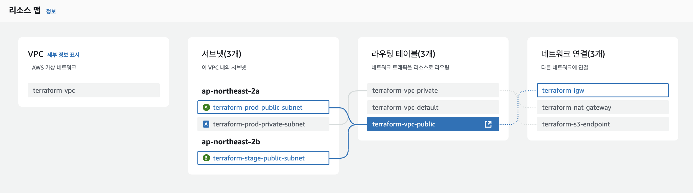
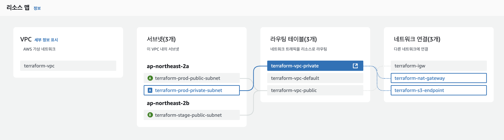

# VPC

현재 디렉토리는 VPC(Virtual Private Cloud)에 대한 내용을 담고 있습니다.

해당 해당 디렉토리에 있는 테라폼 코드를 실행하면, 다음과 같은 VPC 환경이 구성됩니다.

1. VPC
    - CIDR 블록: `var.vpc_cidr_block`에 정의된 값 (기본값: `10.0.0.0/16`)

2. 서브넷
    - 프로덕션 환경
        - 퍼블릭 서브넷 (1개)
        - 프라이빗 서브넷 (1개)
    - 스테이지 환경
        - 퍼블릭 서브넷 (1개)

3. 인터넷 게이트웨이 (IGW)
    - 퍼블릭 서브넷의 트래픽 라우팅

4. NAT 게이트웨이
    - 단일 NAT 게이트웨이 구성 (프라이빗 서브넷 인터넷 접근용)

5. S3 VPC 엔드포인트
    - 프라이빗 서브넷에서 S3로의 전용 통신을 위한 엔드포인트


## VPC 구성





## 구성 요소

- `main.tf`: VPC 리소스를 생성하는 테라폼 코드가 작성되어 있습니다.
- `outputs.tf`: 테라폼 실행 후 출력할 값을 정의하는 파일입니다.
- `variables.tf`: 테라폼 변수를 정의하는 파일입니다.
- `terraform.tfvars`: 테라폼 변수의 값을 설정하는 파일입니다.

## 사전 준비 사항

- AWS CLI 설치 및 계정 설정 (`aws configure`)
- 테라폼 설치

## 시작하기

1. `terraform init` 명령어를 실행하여 테라폼을 초기화합니다.

    ```bash
    terraform init
    ```
2. [terraform.tfvars](./terraform.tfvars) 파일을 수정하여 자신의 환경에 맞게 설정합니다.
3. `terraform plan` 명령어를 실행하여 실행 계획을 확인합니다.

    ```bash
    terraform plan
    ```

4. `terraform apply` 명령어를 실행하여 리소스를 생성합니다.

    ```bash
    terraform apply
    ```

## 정리하기

1. `terraform destroy` 명령어를 실행하여 생성한 리소스를 삭제합니다.

    ```bash
    terraform destroy
    ```